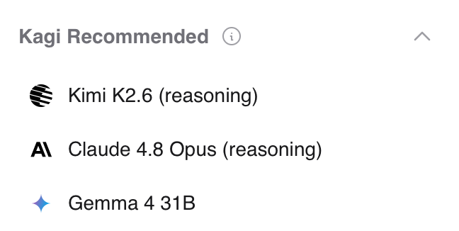

# Kagi Assistant

<br>

<video src="./media/assistant.mp4" width="720" type="video/mp4" autoplay muted loop playsinline disablepictureinpicture />

Kagi Assistant combines the top large language models (LLMs) with optional results from Kagi Search, making it the perfect companion for creative, research, and programming tasks — alongside everything else you can think of! 

All this is included in a single subscription!

## Features

- Access to the latest and most performant large language models from OpenAI, Anthropic, Meta, Google, Mistral, Amazon, Alibaba, and DeepSeek
- Multiple [custom assistants](#custom-assistants)
- The ability to control whether the Assistant has web access (powered by Kagi Search)
- Applying Kagi Search [Lenses](../features/lenses.md) and [Personalized Results](../features/website-info-personalized-results.md) to the Assistant searches
- Saving Assistant threads
- Uploading files to use as context
- Altering the Assistant configuration within the thread
	- For example, you can ask the initial question with web access enabled and then disable it for subsequent questions
	- It is also possible to switch to a different LLM in the middle of a thread
- Code syntax highlighting
- [Keyboard Shortcuts](#keyboard-shortcuts)
- Export conversations as markdown or JSON
- Share threads with others using a link
- Voice input

## Privacy

When you use the Assistant by Kagi, your data is never used to train AI models (not by us or by the LLM providers), and no account information is shared with the LLM providers. By default, threads are deleted after 24 hours of inactivity. This behavior can be adjusted in the [settings](#settings).

## Using the Assistant

Kagi Assistant can be accessed via the apps menu located in the top right corner of all Kagi pages or [by using bangs in search](#bangs). You can also use [this direct link](https://assistant.kagi.com).

When you first access the Assistant, you will be greeted by a familiar-looking landing page, allowing you to get right into using it.
You can either type your prompt or use voice input by pressing the microphone symbol.
You can choose which LLM you wish to use by opening the dropdown menu just below the prompt field.

The Assistant's web access can be toggled via the button below the prompt field.

## Which model to choose

There is no definite answer to the question of what the best LLM is.
As the number of competing models increases, users may find it difficult to find the right one for their task.
To aid in this, Kagi maintains a list of recommended models at the top of the LLM list.

{width=330 height=308}

*Kagi recommended models as of July 1, 2026.*

The recommendations are based on the [Kagi LLM Benchmarking Project](./llm-benchmark.md).
The benchmark tests measure model quality in various scenarios.

Another important aspect is the privacy policy of the model provider.
See our [LLM Privacy Comparison](./llms-privacy.md) for a detailed overview of how each provider handles your data.

## Settings {#settings}

You can manage your Assistant settings by clicking the Settings button in the bottom-left corner of the Assistant window.
Depending on device type and window size, you may have to first open the sidebar by clicking the sidebar icon <svg width="24" height="24" viewBox="-2 -2 28 28" fill="none" stroke="currentColor" stroke-width="1.5" stroke-linecap="round" stroke-linejoin="round" xmlns="http://www.w3.org/2000/svg" style="display:inline; vertical-align:middle;" role="img" aria-label="Assistant Sidebar logo"><path d="M4 4m0 2a2 2 0 0 1 2 -2h12a2 2 0 0 1 2 2v12a2 2 0 0 1 -2 2h-12a2 2 0 0 1 -2 -2z"/><path d="M9 4l0 16"/></svg> on desktop or <svg width="24" height="24" viewBox="0 0 24 24" fill="none" xmlns="http://www.w3.org/2000/svg" style="display:inline; vertical-align:middle;" role="img" aria-label="Mobile menu logo"><path d="M20 5C20.5523 5 21 5.44772 21 6C21 6.55228 20.5523 7 20 7H4C3.44772 7 3 6.55228 3 6C3 5.44772 3.44772 5 4 5H20Z" fill="currentColor"/><path d="M17 11C17.5523 11 18 11.4477 18 12C18 12.5523 17.5523 13 17 13H4C3.44772 13 3 12.5523 3 12C3 11.4477 3.44772 11 4 11H17Z" fill="currentColor"/><path d="M14 17C14.5523 17 15 17.4477 15 18C15 18.5523 14.5523 19 14 19H4C3.44772 19 3 18.5523 3 18C3 17.4477 3.44772 17 4 17H14Z" fill="currentColor"/></svg> on mobile devices.


### General

**Thread Saving**
  - This allows you to configure the thread retention setting. The options are temporary (threads expire 24 hours after the last message) or permanent.
  
**Default Assistant**
  - Choose which assistant is selected by default when opening the Assistant.
  
**Custom Instructions**
  - This text box will allow you to provide instructions and context to the Assistant. These instructions are applied to all interactions unless you are using a custom assistant with its own instructions.
  
### Appearance

**Workspace area**
  - Configure whether the assistant chat utilizes the entire screen (Wide) or is displayed in a more compact view (Standard).

**Font Size**
  - Set the font size for the entire Assistant site (small, medium, normal, large, larger).

**Theme**
  - Choose the theme for the Assistant.
  - Note that this setting is saved locally on your device. If you have a browser extension that clears local storage, it will also reset this setting.

### Custom Assistants
 
  - Kagi Assistant supports creating custom assistants. This allows you to have a customized assistant with the desired LLM, custom instructions, and web search access (including lenses and/or personalized results).
  -  Please see [Custom Assistants](./custom-assistants.md) for further information.
  
### Shortcuts {#keyboard-shortcuts}

You can configure the keyboard shortcuts to fit your workflow.

**Prompt submission trigger** controls whether the shortcut to send a message is Enter or &#8984;/Ctrl + Enter. Adding a modifier key makes it less likely to accidentally submit a prompt before you are finished writing it.

Below you can find the default keybinds.

| Mac Shortcut                | PC shortcut              | Action                  |
|:----------------------------|:-------------------------|:------------------------|
| /                           | /                        | Focus prompt            |
| &#8984; + K                 | Ctrl + K                 | New thread              |
| &#8984; + Shift + Backspace | Ctrl + Shift + Backspace | Delete thread           |
| &#8984; + Shift + S         | Ctrl + Shift + S         | Toggle sidebar          |
| &#8984; + Shift + C         | Ctrl + Shift + C         | Copy last response      |
| &#8984; + Shift + E         | Ctrl + Shift + E         | Edit last message       |
| &#8984; + Shift + G         | Ctrl + Shift + G         | Regenerate last message |
| &#8984; + Shift + M         | Ctrl + Shift + M         | Open model selector     |
| &#8984; + U                 | Ctrl + U                 | Upload file             |
| &#8984; + .                 | Ctrl + .                 | Show keyboard shortcuts |


## Threads

Interactions with the Assistant are stored in threads.

The search bar enables you to find that one elusive thread.

By default, threads are kept for 24 hours after the last message.
If keeping threads alive permanently better fits your workflow, you can adjust this in [the settings](#settings).\
Please note that the thread-saving setting is applied **when the thread is created**.

Threads can be renamed, pinned, made permanent, shared, added to folders, exported, and deleted via the `⋮` button, which is displayed when you hover over the thread.

## Folders

Folders are how Kagi Assistant enables you to organize your threads.
By utilizing folders, you can group threads by topic, so your work and leisure are never mixed.

Folders are mutually exclusive, so a single thread can only be in one folder at a time.

You can customize the look of your folders in the sidebar, making them easier to distinguish.

<video src="./media/assistant-new-folder.mp4" width="240" type="video/mp4" autoplay muted loop playsinline disablepictureinpicture />

## Uploading Files to Assistant

Kagi Assistant supports file uploads, allowing you to provide additional context or information for your queries.

This can be useful for tasks like:

- Summarizing a document
- Extracting key insights from a report
- Analyzing data in a spreadsheet
- Describing an image
- Distilling main points from an audio file

To upload a file:

1. 1. Click the paperclip icon <svg width="24" height="24" viewBox="0 0 15.2936 16.9616" xmlns="http://www.w3.org/2000/svg" style="display:inline; vertical-align:middle;" role="img" aria-label="Attachment icon"><path d="M12.7327 8.95343L6.99054 14.6956C5.49835 16.1956 3.49054 16.0472 2.20929 14.7503C0.920227 13.4691 0.77179 11.4769 2.26398 9.97687L10.0999 2.14874C10.9984 1.25031 12.3187 1.12531 13.178 1.97687C14.0296 2.84406 13.9046 4.15656 13.014 5.05499L5.35773 12.7112C4.97491 13.1097 4.50616 12.9925 4.24054 12.7269C3.97491 12.4534 3.86554 12.0003 4.24835 11.6019L9.59991 6.26593C9.83429 6.02374 9.84991 5.67999 9.62335 5.45343C9.39679 5.23468 9.05304 5.25031 8.81866 5.48468L3.45148 10.8519C2.6546 11.6487 2.68585 12.8675 3.38898 13.5706C4.1546 14.3362 5.31085 14.3206 6.11554 13.5159L13.803 5.82843C15.264 4.36749 15.2015 2.44562 13.928 1.17218C12.6859-0.070006 10.7327-0.163756 9.27179 1.29718L1.39679 9.17999C-0.532898 11.1097-0.38446 13.8675 1.35773 15.6097C3.09991 17.3441 5.85773 17.4925 7.78741 15.5706L13.5687 9.78937C13.7952 9.56281 13.7952 9.14874 13.5609 8.93781C13.3343 8.69562 12.9671 8.72687 12.7327 8.95343Z" fill="currentColor" fill-opacity="0.85"/></svg> in the prompt input box or use the upload shortcut (&#8984;/Ctrl + U by default).
2. Select the file or image you wish to upload.
3. Provide a prompt with instructions to process the file, or leave it blank to summarize it.

Important considerations for file uploads:

- **File size limit:** The maximum file size for uploads is 30 MB.
- **Processing time:** Larger files may take a few moments to process.
- **Context retention:** Uploaded file content remains in the conversation context for subsequent messages.

The Assistant supports various file formats across different categories, including:

| File Type    | Supported Formats                                                                                                                                                                 |
| :----------- | :-------------------------------------------------------------------------------------------------------------------------------------------------------------------------------- |
| Text         | txt, text, md (and other text-based formats)                                                                                                                                      |
| Rich Format  | pdf, docx, pptx                                                                                                                                                                   |
| Spreadsheets | csv, tsv, xlsx, json, jsonl                                                                                                                                                       |
| Image        | jpg, jpeg, png, gif, tiff, tif, webp                                                                                                                                              |
| Audio        | 3gpp, aa, aac, aax, act, aiff, amr, ape, au, awb, dct, dss, dvf, flac, gsm, iklax, ivs, m4a, m4b, m4p, mp4, mmf, mp3, mpc, msv, ogg, opus, ra, rm, sln, tta, vox, wav, wma, wvpla |

Note: Unsupported formats may be treated as binary files.

## Fetching online content

Assistant can fetch webpages and online documents (up to 50 MB) to use them as context for your conversation.
To use this feature, simply paste the URL in your Assistant conversation (make sure the Entire Web toggle is on).

## Available LLMs

| Developer     | Model                                                                                             | Profile                  | Plan     |
| :------------ | :------------------------------------------------------------------------------------------------ | :----------------------- | :------- |
| Alibaba       | [Qwen3-Coder](https://kagi.com/assistant?profile=qwen-3-coder)                                    | qwen-3-coder             | All      |
| Alibaba       | [Qwen3.7 Plus](https://kagi.com/assistant?profile=qwen-3-7-plus)                                  | qwen-3-7-plus            | All      |
| Anthropic     | [Claude 4.5 Haiku](https://kagi.com/assistant?profile=claude-4-haiku)                             | claude-4-haiku           | Ultimate |
| Anthropic     | [Claude 4.6 Sonnet](https://kagi.com/assistant?profile=claude-4-sonnet)                           | claude-4-sonnet          | Ultimate |
| Anthropic     | [Claude 4.8 Opus](https://kagi.com/assistant?profile=claude-4-8-opus)                             | claude-4-8-opus          | Ultimate |
| Anthropic     | [Claude Fable 5](https://kagi.com/assistant?profile=claude-5-fable)                               | claude-5-fable           | Ultimate |
| Anthropic     | [Claude 4.6 Sonnet (Reasoning)](https://kagi.com/assistant?profile=claude-4-sonnet-thinking)      | claude-4-sonnet-thinking | Ultimate |
| Anthropic     | [Claude 4.8 Opus (Reasoning)](https://kagi.com/assistant?profile=claude-4-8-opus-thinking)        | claude-4-8-opus-thinking | Ultimate |
| Anthropic     | [Claude Fable 5 (Reasoning)](https://kagi.com/assistant?profile=claude-5-fable-thinking)          | claude-5-fable-thinking  | Ultimate |
| Anthropic     | [Claude 4.5 Haiku (Reasoning)](https://kagi.com/assistant?profile=claude-4-haiku-thinking)        | claude-4-haiku-thinking  | Ultimate |
| DeepSeek      | [DeepSeek V4 Pro](https://kagi.com/assistant?profile=deepseek-v4-pro)                             | deepseek-v4-pro          | Ultimate |
| DeepSeek      | [DeepSeek V4 Flash](https://kagi.com/assistant?profile=deepseek-v4-flash)                         | deepseek-v4-flash        | All      |
| Google        | [Gemini 3.5 Flash](https://kagi.com/assistant?profile=gemini-3-5-flash)                           | gemini-3-5-flash         | Ultimate |
| Google        | [Gemini 2.5 Pro](https://kagi.com/assistant?profile=gemini-2-5-pro)                               | gemini-2-5-pro           | Ultimate |
| Google        | [Gemini 3.1 Pro (Preview)](https://kagi.com/assistant?profile=gemini-3-pro)                       | gemini-3-pro             | Ultimate |
| Google        | [Gemini 3.1 Flash Lite (preview)](https://kagi.com/assistant?profile=gemini-3-1-flash-lite)       | gemini-3-1-flash-lite    | All      |
| Google        | [Gemma 4 31B](https://kagi.com/assistant?profile=gemma-4-31b)                                     | gemma-4-31b              | All      |
| Mistral AI    | [Mistral Small 4](https://kagi.com/assistant?profile=mistral-small-4)                             | mistral-small-4          | All      |
| Mistral AI    | [Mistral Small 3](https://kagi.com/assistant?profile=mistral-small)                               | mistral-small            | All      |
| Mistral AI    | [Mistral Medium 3.5](https://kagi.com/assistant?profile=mistral-medium-3-5)                       | mistral-medium-3-5       | Ultimate |
| Mistral AI    | [Mistral Large 3](https://kagi.com/assistant?profile=mistral-large)                               | mistral-large            | All      |
| MiniMax       | [MiniMax M3](https://kagi.com/assistant?profile=minimax-m3)                                       | minimax-m3               | All      |
| Moonshot AI   | [Kimi K2.7 Code](https://kagi.com/assistant?profile=kimi-k2-7-code)                               | kimi-k2-7-code           | Ultimate |
| Nous Research | [Hermes-4-405B (reasoning)](https://kagi.com/assistant?profile=hermes-4-405b-thinking)            | hermes-4-405b-thinking   | All      |
| OpenAI        | [GPT 5.4 Mini](https://kagi.com/assistant?profile=gpt-5-4-mini)                                   | gpt-5-4-mini             | All      |
| OpenAI        | [GPT 5.4 Nano](https://kagi.com/assistant?profile=gpt-5-4-nano)                                   | gpt-5-4-nano             | All      |
| OpenAI        | [GPT OSS 120B](https://kagi.com/assistant?profile=gpt-oss-120b)                                   | gpt-oss-120b             | All      |
| OpenAI        | [GPT 5.5](https://kagi.com/assistant?profile=gpt-5-5)                                             | gpt-5-5                  | Ultimate |
| OpenAI        | [ChatGPT](https://kagi.com/assistant?profile=chatgpt-4o)                                          | chatgpt-4o               | Ultimate |
| xAI           | [Grok 4.3](https://kagi.com/assistant?profile=grok-4-3)                                           | grok-4-20                | All |
| Z.ai          | [GLM-5.2](https://kagi.com/assistant?profile=glm-5-2)                                             | glm-5-2                  | Ultimate |
| Z.ai          | [GLM-5.2 (reasoning)](https://kagi.com/assistant?profile=glm-5-2-thinking)                        | glm-5-2-thinking         | Ultimate |
| Z.ai          | [GLM-4.7](https://kagi.com/assistant?profile=glm-4-7)                                             | glm-4-7                  | All      |
| Z.ai          | [GLM-4.7 (reasoning)](https://kagi.com/assistant?profile=glm-4-7-thinking)                        | glm-4-7-thinking         | All      |


You can learn more about how these models compare in the [Kagi LLM Benchmarking Project](./llm-benchmark.md) page.

For more information about each model and its privacy practices, including details about providers, see our [LLM Privacy](./llms-privacy) page.


## Bangs

You can quickly access Assistant using the following [bangs](../features/bangs.md):

- `!ai`, `!as`, `!assistant`, `!research`, `!answer`, `!discuss`, `!expert`, `!llm`, `!custom`, and `!asst`: These bangs direct you to the general Assistant interface for various types of queries.

- `!chat`: This bang accesses Assistant with internet access turned off.

- `!code`: Use this bang to access the built-in **Code** Custom Assistant, which is tailored for coding-related queries.

- `!ki` and `!quick`: These bangs access Assistant with the Quick profile, providing a fast, direct answer to your queries.

- `!study`: This bang opens the Assistant with the Study assistant.

- `!news`: This bang opens the Assistant with the News custom assistant.

See [Custom Assistants](./custom-assistants.md) for further information about the custom assistants.

Each bang is designed to optimize your search experience by directing you to the most appropriate version of Assistant for your needs.

## URL Parameters

You can specify a particular model in the Assistant's URL by including a `profile` parameter.
`https://kagi.com/assistant?profile=gpt-5`
The available model names can be found in the table above.

The `internet` parameter can be used to turn on and off internet access, set to `true` to enable, anything else to disable. This overrides the internet setting of the profile used.

The `lens` parameter can be used to set the lens if internet access is enabled. The value of this is the lowercase format of the lens name, for example, `https://kagi.com/assistant?lens=programming` will use the Programming lens.

The `q` parameter can be used to submit a prompt immediately after the page loads. The `qvalue` parameter can be used to prefill the prompt box without submitting it.

Here is an example of a URL that enables internet access, uses the **Claude 4 Sonnet** model, applies the **Recipes lens**, and submits a prompt immediately. You might use it as a target for a custom bang.
```https://kagi.com/assistant?profile=claude-4-sonnet&internet=true&lens=recipes&q=%s```

## Availability

Assistant is available to all members. However, premium models are only available in our Ultimate plan.
If you are on a different plan and you need access to these models, you can upgrade from the [Billing Settings](https://kagi.com/settings/billing_plan) page.

We also offer an Ultimate upgrade for Family Plans. You can upgrade from the [Family Management](https://kagi.com/settings/account_members) page.

## Usage Limits

### Context window limit

There's no fixed limit on conversation length. We automatically optimize lengthy chats behind the scenes to maintain performance using summarization and truncation techniques. Currently, these techniques are used when the chat history reaches about 32k tokens in size.

### Input limitations

#### Text input

- **Maximum 100,000 characters** per message
- Text exceeding this limit will be automatically truncated

#### File uploads

- **Maximum total size: 30 MB** (applies to single or multiple files)
- **URL content: 50 MB** maximum retrievable size

### Custom Instructions

- **Maximum 20,000 characters** for custom Assistant instructions

### Fair Use Policy

We use a value-based usage system to maintain high-quality service for all users:

- Your monthly plan determines your token usage allowance.
    - For example, a **$25 monthly plan** provides up to **$25 worth of token usage** across all models.
- For yearly plans, you get access to the full year's worth of token usage at the start of the plan.
    - For instance, the **Ultimate yearly plan** allows up to **$270 worth of token usage for the entire year**.
- A **20% margin markup** is included in token usage cost calculations to cover search queries, infrastructure, and development costs.
    - For example, **$25 token usage** consists of **$20 for raw token costs** and **$5 for operational costs**.
- Users will receive an in-app reminder as they near their usage limit. If the limit is exceeded, new AI interactions will be disabled until they either renew their plan early or the next billing cycle begins.
    - **Note:** We will soon introduce the option to purchase top-up credits, allowing you to extend Assistant usage beyond fair-use limits with an amount of your choice. These credits can then also be used for other Kagi products such as the API.

For additional questions about these limitations or policies, please contact our support team.

### Tips to reduce token usage

Here are some suggestions to reduce token usage:

1. Use less expensive models for simple tasks like summarization or basic information extraction. Our [LLM Benchmarking project](https://help.kagi.com/kagi/ai/llm-benchmark.html) page contains cost information for the different models.
2. Create new threads for unrelated questions rather than continuing in the same conversation.
3. Be specific and concise in your prompts to get more focused responses.
4. Use the "Edit Prompt” feature (pencil icon) to refine your question instead of sending multiple clarifications.
5. Disable web access when you don't need internet information.
6. Limit file uploads to only what's necessary for your query.
7. Break complex tasks into smaller, focused questions across multiple threads.
8. Use custom instructions to request consistently concise responses.
9. Leverage specialized custom assistants optimized for specific tasks.
10. Download and delete completed threads to avoid accidentally continuing old conversations.

## FAQ

**Q**: What is Kagi’s stance about using LLMs in search?\
**A**: We continue to relentlessly focus on the core search experience and build thoughtfully integrated features on top of it. Read more about it in our [AI Integration Philosophy](../why-kagi/ai-philosophy.md) page.

**Q**: Why is Assistant unable to access the web?\
**A**: Check to make sure you haven't disabled web access. Look for the lens selector dropdown under the prompt entry box to the right of the model selector. Tap the globe to enable or disable web access. It should be colored light purple when web access is enabled. If you are still having issues, please contact support.
